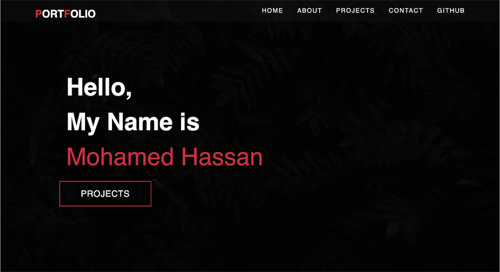

# [(React) Personal Portfolio](https://github.com/fondofhats/react-portfolio)


## Description

This is a project was developed for the UCF Coding Bootcamp.  
 The application contained within is a personal portfolio website built with Reactjs.

## Table of Contents

- [Installation](##Installation)
- [Usage](##Usage)
- [Documentation](##Documentation)
- [Questions](##Questions)

## Installation

Installation is a process of installing the dependencies required.
Intialize node package manager and then run the following commands;

```script
npm install
```

## Usage

In order to use the application locallaly, Run the following command:

```script
npm start
```

#### Screenshot



### Link to the application running on Github Pages: [(React) Portfolio]()

## Questions

Email Mohamed Hassan with any support questions at [mohamedisaaq0@gmail.com](mailto:mohamedisaaq0@gmail.com)\
or visit my [GitHub Homepage](https://github.com/mohamedisaaq0).
